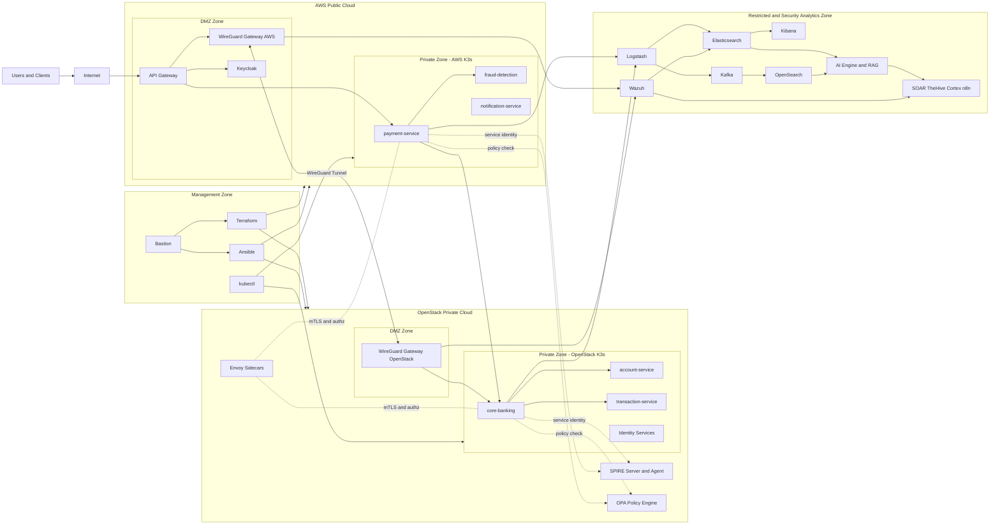

# ZTLab — Zero Trust Security Detection & Response System
### Microservices · Multi-Cloud (AWS + OpenStack) · SIEM · SOAR · AI

> **Đồ án chuyên ngành — UIT**  
> Author: Hoàng Bảo Phước
> Co-Author: Phạm Võ Khánh Hà
> GVHD: Đỗ Thị Phương Uyên · 05/02/2026 → 30/05/2026

---

## Mô tả ngắn

Hệ thống triển khai kiến trúc **Zero Trust** cho ứng dụng tài chính microservices phân tán trên hai nền tảng cloud (AWS Public + OpenStack Private), tích hợp SIEM/SOAR hỗ trợ AI để phát hiện và phản ứng sự cố bảo mật tự động.

```
Internet → [DMZ: WireGuard + API Gateway + Keycloak]
         → [Private: K3s Microservices + SPIRE + OPA + Envoy]
         → [Restricted: ELK + Kafka + OpenSearch + AI + SOAR]
         ← [Management: Bastion + Terraform + Ansible]

OpenStack (Private Cloud) ←→ AWS (Public Cloud) via WireGuard tunnel
```

## Sơ đồ hệ thống chi tiết




---

## Tài liệu chính

| File | Nội dung |
|------|----------|
| `IMPLEMENTATION.md` | Toàn bộ hướng dẫn triển khai chi tiết (config, code, script) |
| `MAP.md` | Ánh xạ logic → thư mục → file → section trong IMPLEMENTATION.md |
| `README.md` | File này |

---

## Cấu trúc repo (tóm tắt)

```
ztlab/
├── README.md
├── MAP.md
├── IMPLEMENTATION.md
│
├── terraform/          # IaC — provision AWS + OpenStack nodes
├── ansible/            # Configuration management — baseline + install
├── k8s/                # Kubernetes manifests cho cả 2 cluster
├── services/           # Source code 7 financial microservices (FastAPI)
├── shared/             # Python modules dùng chung giữa services
├── opa/                # OPA Rego policies (ZTA enforcement)
├── envoy/              # Envoy sidecar config templates
├── spire/              # SPIRE server/agent config + registration scripts
├── siem/               # ELK config, Wazuh rules/decoders, Logstash pipelines
├── kafka/              # Kafka + Zookeeper config, topic definitions
├── opensearch/         # OpenSearch anomaly detectors
├── ai-engine/          # ML models (IF, LSTM), RAG pipeline, MCP server
├── soar/               # TheHive + Cortex + n8n configs + Cortex Responders
├── wireguard/          # WireGuard VPN config (server + client)
├── monitoring/         # Kibana dashboards, Prometheus rules
├── tests/              # Attack simulation scripts + metrics collection
└── scripts/            # Utility scripts (seed DB, health check, cert gen)
```

---

## Quick Start

```bash
# 1. Clone và setup môi trường
git clone https://github.com/ztlab/ztlab.git && cd ztlab
cp .env.template .env   # điền đầy đủ secrets trước khi tiếp tục

# 2. Provision hạ tầng
cd terraform/aws && terraform init && terraform apply
cd ../openstack && terraform init && terraform apply

# 3. Cấu hình nodes
cd ../../ansible
ansible-playbook -i inventory/hosts.yml playbooks/baseline.yml
ansible-playbook -i inventory/hosts.yml playbooks/wireguard.yml
ansible-playbook -i inventory/hosts.yml playbooks/k3s.yml

# 4. Deploy security stack
kubectl apply -f k8s/spire/
kubectl apply -f k8s/keycloak/
kubectl apply -f k8s/financial/

# 5. Deploy SIEM + SOAR
cd ../soar && docker compose up -d
cd ../siem && docker compose up -d

# 6. Local test (không cần cloud)
docker compose -f services/docker-compose.local.yml up -d
curl http://localhost:8080/health
```

> Xem `MAP.md` để biết chính xác file nào cần chỉnh sửa cho từng tác vụ.

---

## Phân công

| Hạng mục | Thực hiện |
|----------|-----------|
| Kiến trúc hệ thống, Threat Model (STRIDE), SIEM design | Khánh Hà |
| Hạ tầng OpenStack, K3s, ELK Stack, Kafka, Kibana | Bảo Phước |
| AI Detection Engine, RAG pipeline, ML models | Khánh Hà |
| SOAR (TheHive, Cortex, n8n), HITL workflow | Bảo Phước |
| Financial microservices (application code) | Cả hai |
| Testing, đánh giá metrics, báo cáo | Khánh Hà |
